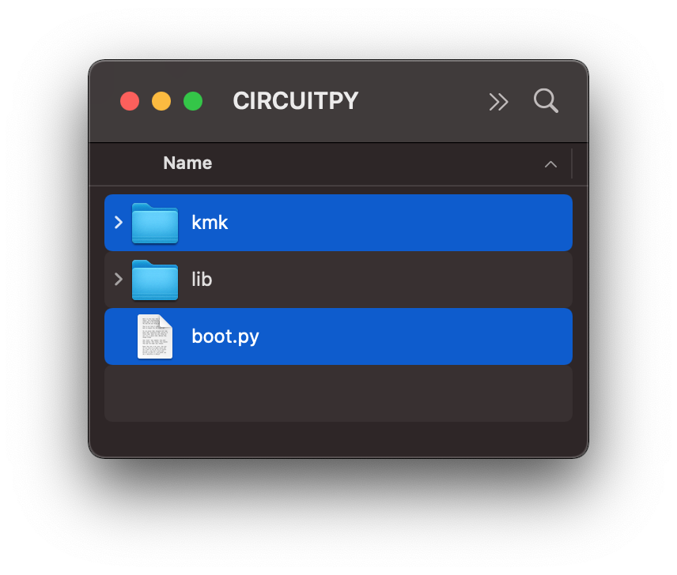
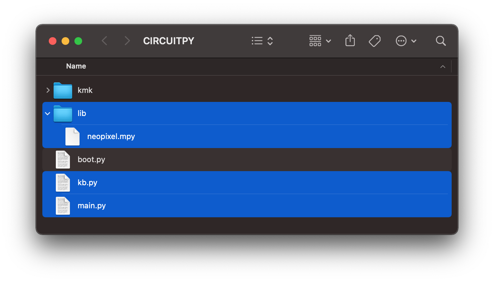

# Documentation

<figure markdown>
  { width="460" }
  <figcaption></figcaption>
</figure>

A comprehensive guide of my KMK firmware[^1] for the  splayortoraid keyboard (Messenger Edition)[^2].
## Installation

<!-- prettier-ignore-start -->
??? tip "tl;dr"
    [Install CircuitPython](#install-circuitpython)  
    [Install KMK](#install-kmk)  
    [Copy `kb.py`, `main.py` & `lib` to your splaytoraid](#install-splaytoraid-firmware)
<!-- prettier-ignore-end -->

### Install CircuitPython

KMK is a keyboard focused layer that sits on top of CircuitPython.  
[**Follow these steps**](https://learn.adafruit.com/welcome-to-circuitpython/installing-circuitpython) and then come back here.

### Install KMK

1. Get [a copy of KMK](https://github.com/KMKfw/kmk_firmware/archive/refs/heads/master.zip) from the master branch
2. Unzip and copy the `kmk` folder and the `boot.py` file to the root of the USB drive
3. Delete `code.py` from the USB drive

<figure markdown>
  { width="500" }
  <figcaption>Content of USB Drive after installing KMK</figcaption>
</figure>

<!-- { width="500"} -->

### Install splaytoraid firmware

1. Download the `kb.py`, `main.py` and `lib` from the GitHub repository and copy them onto your USB drive  
   You can find those files in `splaytoraid_kmk_firmware.zip` via [GitHub releases](https://github.com/moritz-john/kmk-config-splaytoraid/releases)
2. Reboot the microcontroller

<figure markdown>
  { width="800" }
  <figcaption>Content of USB Drive after adding splaytoraid specific firmware files</figcaption>
</figure>

<!-- { width="800"} -->

---

## Microcontroller Support

[`kb.py`](https://github.com/moritz-john/kmk-config-splaytoraid/blob/master/firmware/kb.py) is designed to work with the **SparkFun Pro Micro RP2040** but you can update this line in `kb.py` to [any supported microcontroller](https://github.com/KMKfw/kmk_firmware/tree/master/kmk/quickpin/pro_micro) e.g.:

```python title='Default: SparkFun Pro Micro RP2040'
from kmk.quickpin.pro_micro.sparkfun_promicro_rp2040 import pinout as pins
```

```python title='Alternative: 0xCB Helios'
from kmk.quickpin.pro_micro.helios import pinout as pins
```

```python title='Alternative: Adafruit KB2040'
from kmk.quickpin.pro_micro.kb2040 import pinout as pins
```

**...**

---

## RGB Setup

<!-- prettier-ignore-start -->
<!-- ??? tip "TL;DR:"
    - Add library to your keyboard drive, set `:::py splaytoraid_rgb = True` and `:::py splaytoraid_keys = 40` or `:::py 36` keys  
    - Customize your RGB values and add RGB keycodes to your keymap -->
<!-- prettier-ignore-end -->

### Add RGB library

In order to use RGB make sure you copied the `'lib'` folder onto your splaytoraid in the [installation step](#install-splaytoraid-firmware).  
The `'lib'` folder should contain the file `neopixel.mpy`.

### Activate RGB

You have to change the variable `splaytoraid_rgb` from `False` to `True` in your [`main.py`](https://github.com/moritz-john/kmk-config-splaytoraid/blob/master/firmware/main.py) file and set `splaytoraid_keys` to the amount of keys you are using:

```py title="main.py"
--8<-- 'firmware/main.py:config'
```

### Customize RGB

_You can find this code in your [`kb.py`](https://github.com/moritz-john/kmk-config-splaytoraid/blob/master/firmware/kb.py) file:_

```py title="kb.py"
--8<-- 'firmware/kb.py:rgb'
```

Consider changing `hue_default`, `sat_default` or `val_default`. Use a value in the range `0-255`.  
Read more about the possible configuration options [HERE](https://github.com/KMKfw/kmk_firmware/blob/master/docs/en/rgb.md#configuration).

### Control RGB via keycodes

You **need** to add some [keycodes](https://github.com/KMKfw/kmk_firmware/blob/master/docs/en/rgb.md#keycodes) to your keymap in order to control your RGB lighting e.g.:

| Keycode    | Description           |
| :--------- | :-------------------- |
| ++rgbtog++ | Toggles RGB on or off |
| ++rgbhui++ | Increase Hue          |
| ++rgbhud++ | Decrease Hue          |
| ++rgbsai++ | Increase Saturation   |
| ++rgbsad++ | Decrease Saturation   |
| ++rgbvai++ | Increase Value        |
| ++rgbvad++ | Decrease Value        |

---

## Hide Device Storage (optional)

Here is how to hide your microcontroller from showing up as a USB storage by default.  
I would recommend following these steps **after** you finished setting up your splaytoraid & keymap:

- Copy this specifig [`boot.py`](https://github.com/moritz-john/kmk-config-splaytoraid/tree/master/firmware/utilities/hide_device_storage) onto your `'CIRCUITPY'` USB storage and replace the existing file.
- You can still access the device USB storage by holding a certain key on startup

<!-- prettier-ignore-start -->
!!! warning
    **After replacing `boot.py` you need to hold the green key when connecting the keyboard to your computer in order to access its USB storage.**
<!-- prettier-ignore-end -->

<figure markdown>
  { width="1000" }
  <figcaption></figcaption>
</figure>

### Microcontroller support

`boot.py` is designed to work with the **SparkFun Pro Micro RP2040** but you can update this line in `boot.py` to [any supported microcontroller:](https://github.com/KMKfw/kmk_firmware/tree/master/kmk/quickpin/pro_micro)

```py
from kmk.quickpin.pro_micro.sparkfun_promicro_rp2040 import pinout as pins
```

[^1]: [KMK](https://github.com/KMKfw/kmk_firmware) is a feature-rich and beginner-friendly firmware for computer keyboards written and configured in [CircuitPython](https://circuitpython.org/)
[^2]: A keyboard designed by [freya](https://linktr.ee/freya_irl) and exclusively available through [keeb.supply](https://keeb.supply/products/splaytoraid-messenger-edition)
